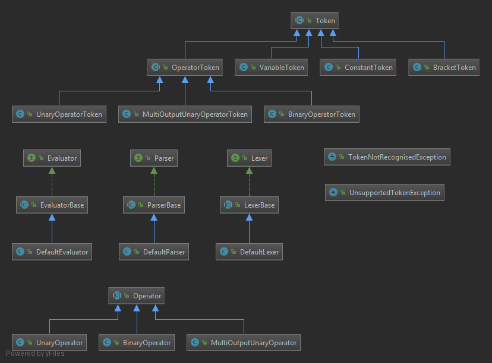

# ShuntingYard [](https://travis-ci.com/ed-cooper/ShuntingYard)
Java implementation of Dijkstra's Shunting-Yard algorithm for parsing and evaluating mathematical expressions.

Contains support for:
- Operator precedence
- Brackets
- Functions (e.g. sine)
- Left-associative operators (e.g. ^)
- The plus-minus notation (e.g. ±5)
- Variables (e.g. x)
- Constants (e.g. π)

## Usage
The algorithm has been divided into 3 main units:
- **Lexer**: Tokenises a raw expression
- **Parser**: Converts a tokenised expression into Reverse-Polish Notation (RPN) form
- **Evaluator**: Evaluates an expression in RPN form to produce a list of output values

### Basic Demo
```Java
// Initial expression
String expression = "±(2+1*3)+√(2^2)";

// Step 1: Lexer
Lexer lexer = new DefaultLexer();
List<Token> tokens = lexer.readTokens(expression);

// Step 2: Parser
Parser parser = new DefaultParser();
List<Token> rpn = parser.parse(tokens);

// Step 3: Evaluator
Evaluator evaluator = new DefaultEvaluator();
List<Double> outputs = evaluator.evaluate(rpn);

// Output values
System.out.println(expression + "=");
for (Double value : outputs) {
    System.out.println(value);
}

// Produces:
// ±(2+1*3)+√(2^2)=
// 7.0
// -3.0
```

### Variables Demo
When using variables, we need to define variables both in the lexer and the evaluator.

The lexer definitions are required to prevent any invalid tokens being interpreted as
variable names.

The evaluator definitions are kept separate as a map of names to values so that, when
the value of a variable is udpated, the expression can be evaluated again without the
need to tokenise and parse the equation again (which is a relatively computationally
expensive operation).

Note: if a variable is not defined in either the lexer or evaluator, an exception will
be thrown.

```Java
// Initial expression
String expression = "x*y";

// Step 1: Lexer
DefaultLexer lexer = new DefaultLexer();
lexer.getVariables().add("x"); // Define variable x
lexer.getVariables().add("y"); // Define variable y
List<Token> tokens = lexer.readTokens(expression);

// Step 2: Parser
DefaultParser parser = new DefaultParser();
List<Token> rpn = parser.parse(tokens);

// Step 3: Evaluator
DefaultEvaluator evaluator = new DefaultEvaluator();
evaluator.getVariables().put("x", 3d); // Define x with value 3
evaluator.getVariables().put("y", 4d); // Define y with value 4
List<Double> outputs = evaluator.evaluate(rpn);

// Output values
System.out.println(expression + "=");
for (Double value : outputs) {
    System.out.println(value);
}

// Re-run with different values
evaluator.getVariables().put("x", 5d); // Re-define x with value 5
evaluator.getVariables().put("y", 6d); // Re-define y with value 6
outputs = evaluator.evaluate(rpn);

// Output values
System.out.println(expression + "=");
for (Double value : outputs) {
    System.out.println(value);
}

// Produces:
// x*y=
// 12.0
// x*y=
// 30.0
```

## Class Diagram

